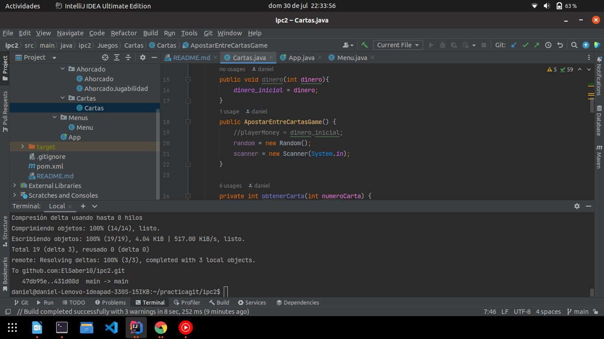
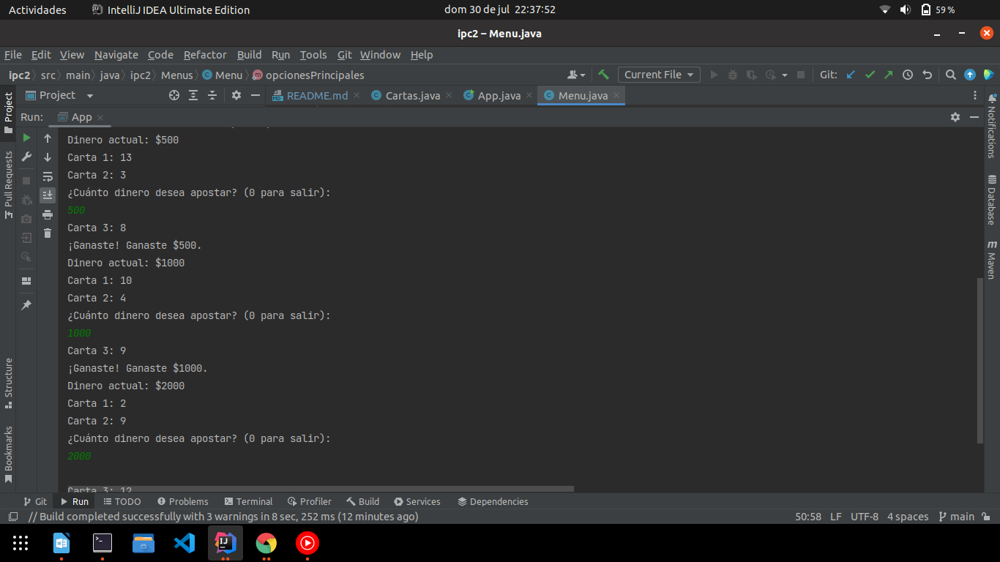
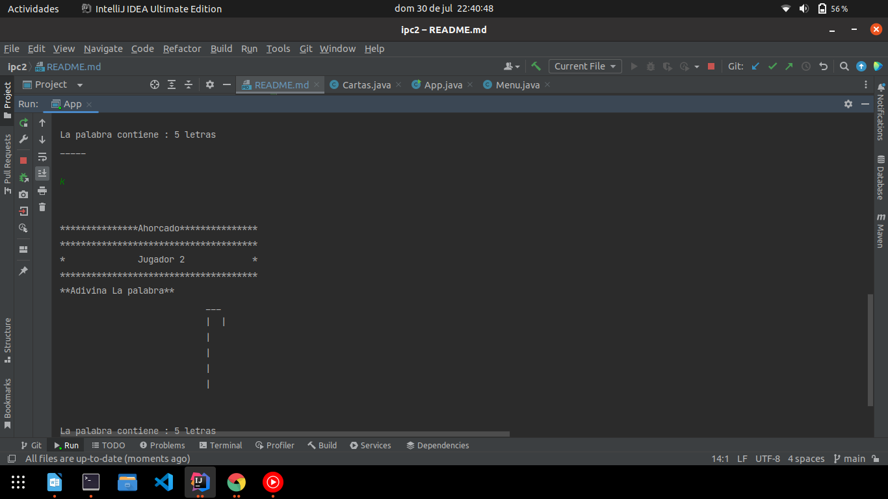
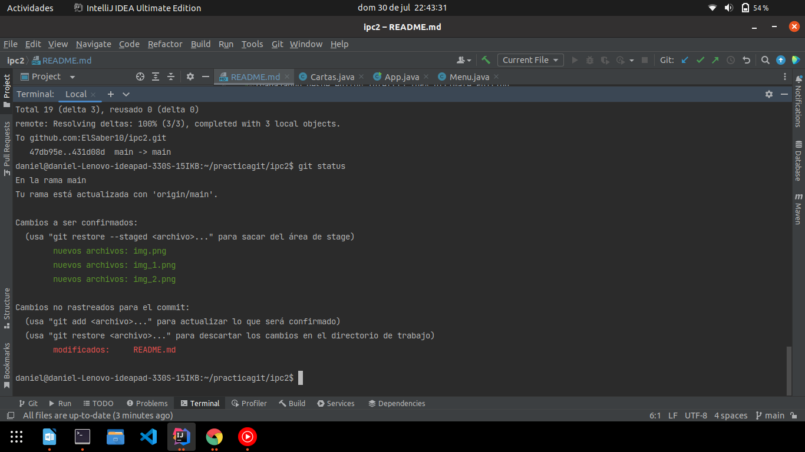

# Práctica Ipc2 Con git keys .ssh
Entrega practica git en parejas. 

Trabajando desde editor IntelliJ IDEA Ultimate Edition
Trabajo realizado por:

## **Jorge Daniel Sacor Barrios 201931582**
## **Carlos Raúl Alberto López Peláez 202031871**

### _**Trabajado en InteliJ**_

### **_Juegos intuitivos._**

### **_Trabajando con GitHub desde terminal de IntelliJ IDEA_**

